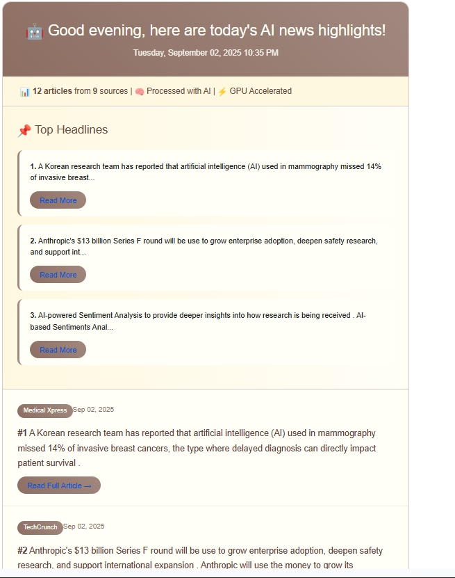

# 🤖 AI News Agent - Enhanced Version

An intelligent, autonomous AI-powered news aggregation system that fetches, processes, and delivers personalized AI news directly to your inbox with learning capabilities and interactive commands.

## ✨ Features

### 🔍 Intelligent News Fetching
- **Multi-Source Aggregation**: Fetches from 8+ RSS feeds and 3 news APIs
- **AI-Focused Content**: Specialized in artificial intelligence, machine learning, and tech innovation news
- **Smart Deduplication**: Uses semantic analysis to remove duplicate articles
- **Rate Limiting**: Respects API limits with intelligent request management

### 🧠 AI-Powered Processing
- **GPU Acceleration**: Utilizes CUDA for faster AI model inference
- **Smart Summarization**: Uses DistilBART model for concise article summaries
- **Semantic Analysis**: Employs sentence transformers for content similarity detection
- **Quality Filtering**: Automatically filters low-quality or irrelevant content

### 🎯 Learning & Adaptation
- **User Feedback Integration**: Learns from user ratings and feedback
- **Pattern Recognition**: Identifies successful content patterns
- **Adaptive Queries**: Modifies search strategies based on performance
- **Performance Metrics**: Tracks and optimizes system performance

### 💬 Interactive Command Interface
- **Real-time Commands**: Interactive chat-like interface for immediate control
- **Instant Email Dispatch**: Send news emails on-demand with `send_email` command
- **Custom Fetching**: Fetch news on any topic with `fetch [topic]`
- **Feedback System**: Rate articles to improve AI recommendations

### 📧 Personalized Email Delivery
- **Beautiful HTML Emails**: Rich formatting with images and styling
- **Scheduled Delivery**: Autonomous daily email delivery at 8:00 AM
- **Breaking News Alerts**: Hourly checks for important updates
- **Customizable Frequency**: Supports daily, weekly, or breaking news preferences

## 🚀 Quick Start

### Prerequisites
- Python 3.8+
- CUDA-capable GPU (optional, but recommended)
- Gmail account with app password
- API keys for news services

### Installation

1. **Clone the repository**
```bash
git clone https://github.com/yourusername/ai-news-agent.git
cd ai-news-agent
```

2. **Install dependencies**
```bash
pip install -r requirements.txt
```

3. **Set up environment variables**
Create a `.env` file in the project root:
```env
# News API Keys
NEWSDATA_API_KEY=your_newsdata_api_key
GNEWS_API_KEY=your_gnews_api_key
MEDIASTACK_API_KEY=your_mediastack_api_key
WORLDNEWS_API_KEY=your_worldnews_api_key

# Email Configuration
GMAIL_USER=your_email@gmail.com
GMAIL_APP_PASSWORD=your_app_password
RECIPIENT_EMAIL=recipient@gmail.com
```

4. **Run the agent**
```bash
python newsagent.py
```

## 💻 Interactive Commands

Once the agent is running, you can use these commands:

| Command | Description | Example |
|---------|-------------|---------|
| `fetch [topic]` | Get latest news on any topic | `fetch quantum computing` |
| `send_email` | Send news email immediately | `send_email` |
| `feedback [1-5] [url]` | Rate an article (1-5 stars) | `feedback 5 https://example.com` |
| `sources` | Show all active news sources | `sources` |
| `keywords` | Display current search keywords | `keywords` |
| `status` | Check agent performance stats | `status` |
| `help` | Show available commands | `help` |
| `quit` | Exit the agent | `quit` |

## 🔧 Configuration

### News Sources
The agent monitors these sources by default:
- **APIs**: NewsData.io, GNews, Mediastack
- **RSS Feeds**: MIT AI News, VentureBeat AI, Wired AI, TechCrunch AI, IEEE Spectrum, AI Research, OpenAI Blog

### Search Keywords
Default AI-focused keywords:
- Artificial Intelligence
- Machine Learning
- Deep Learning
- Neural Networks
- AI Breakthrough
- Tech Innovation
- AI Research

### Scheduling
- **Daily News**: 8:00 AM automatic delivery
- **Breaking News**: Hourly checks
- **Health Checks**: Every 30 minutes

## 🎯 Target Audience

Perfect for:
- AI researchers and practitioners
- Tech industry professionals
- Students in AI/ML fields
- Anyone interested in staying updated with AI developments

## 📊 Performance Features

- **Smart Caching**: Avoids duplicate processing
- **Adaptive Learning**: Improves recommendations over time
- **Performance Metrics**: Tracks success rates and user satisfaction
- **Error Handling**: Robust error recovery and logging
 
## 📸 Usage Examples

**Agent Startup**  


**Email HTML Preview**  


**Fetch Command Output**  


**send_email Command Output**  



## 🔒 Privacy & Security

- Environment variables for sensitive data
- No personal data stored on external servers
- Local SQLite database for user preferences
- Secure email authentication

## 📈 System Requirements

**Minimum:**
- Python 3.8+
- 4GB RAM
- 2GB disk space

**Recommended:**
- Python 3.9+
- 8GB RAM
- NVIDIA GPU with 4GB+ VRAM
- 5GB disk space

## 🤝 Contributing

1. Fork the repository
2. Create a feature branch (`git checkout -b feature/amazing-feature`)
3. Commit your changes (`git commit -m 'Add amazing feature'`)
4. Push to the branch (`git push origin feature/amazing-feature`)
5. Open a Pull Request

## 📜 License

This project is licensed under the MIT License - see the [LICENSE](LICENSE) file for details.

## 🙏 Acknowledgments

- Hugging Face for transformer models
- Sentence Transformers for semantic analysis
- All the news sources for providing quality content
- Open source community for amazing libraries

## 📞 Support

If you encounter any issues or have questions:
1. Check the existing issues on GitHub
2. Create a new issue with detailed description
3. Include logs and system information

---

**Made with ❤️ for the AI community**
